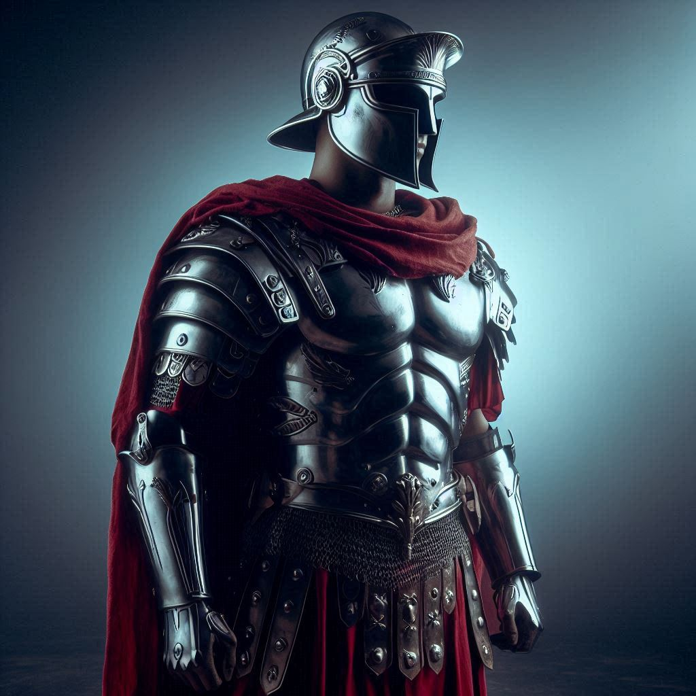
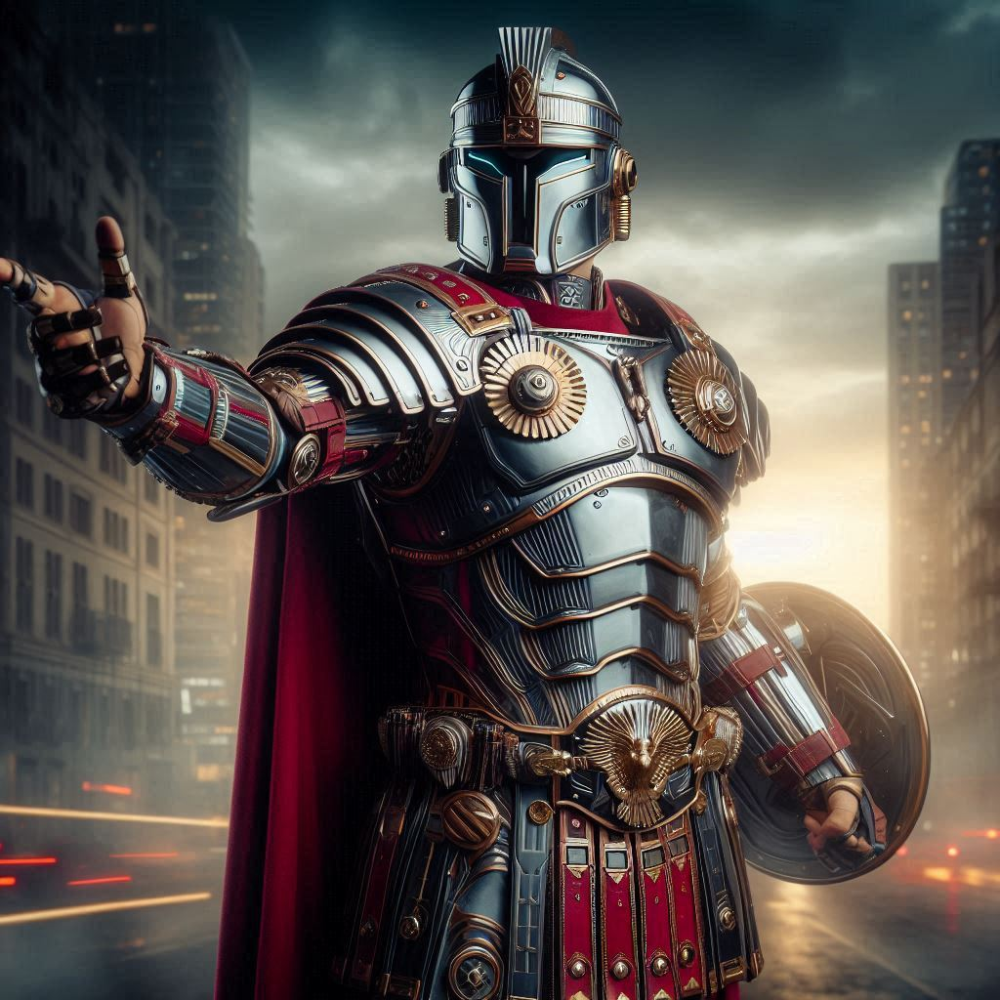
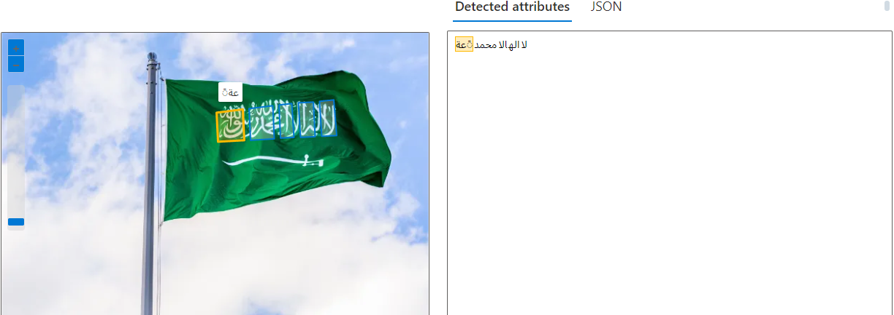

  
  <h1>Relatorio-AzureIA-IA-Generativa</h1>
  

  
  

  
  
  

 

## Testando o Copilot:

### Parte 1: Acessando o copilot da microsoft.

[https://copilot.microsoft.com/](https://copilot.microsoft.com/)

### Parte 2: Formulando prompt para geração de imagem.

> #### "Gere a imagem de um legionario romano futurista, o mesmo possui uma armadura da era classica, porém futurista. O soldado romano deve ser humano".

### Resultados:

#### Imagem 1:

#### Imagem 2:

> Repare que para um mesmo prompt, pode haver variações, os resultados podem até serem semelhantes, mas sempre serão diferentes.

## Reconhecimento de texto em imagens:

### Opção do recurso no Azure:

[https://portal.vision.cognitive.azure.com/demo/extract-text-from-images](https://portal.vision.cognitive.azure.com/demo/extract-text-from-images)

### Imagem a ser analisada:

### Resultados:

> #### Tradução de "لاالهالامحمد◌َعة" para PT-BR: "Não há outra divindade além de Alá, e Maomé é o Mensageiro de Alá".

## Conclusão:

Com base nas tecnologias apresentadas, Azure IA e IA Generativa, fica claro seu potencial em diferentes cenários. O Copilot da Microsoft destaca-se pela capacidade de gerar conteúdo textual e visual a partir de prompts, útil para áreas como design gráfico e prototipagem. Além disso, o reconhecimento de texto em imagens, exemplificado pelo Azure, revela a utilidade da IA na extração de informações visuais, com aplicações em automação e análise de dados. Em resumo, essas ferramentas oferecem soluções inovadoras e eficazes, tornando-se recursos valiosos para empresas e profissionais em diversas áreas.
